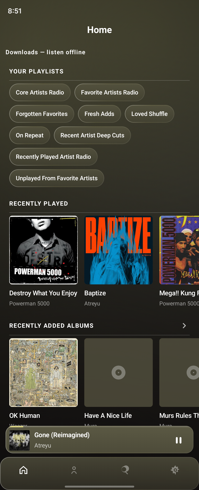
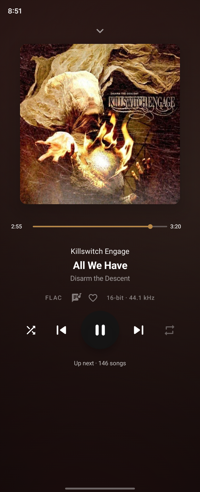
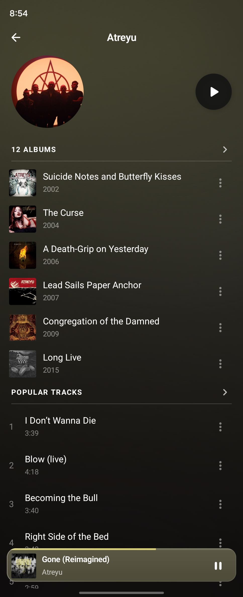
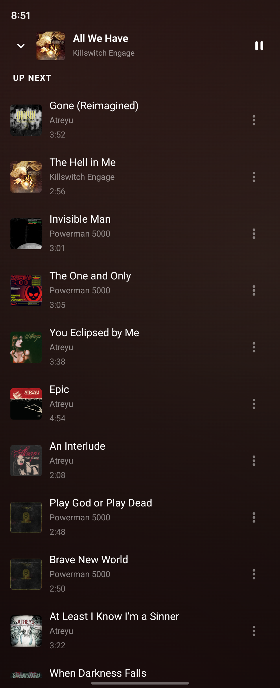

# Sonveil

**A music player for the library you host.** Sonveil is a native Android app for Navidrome, Subsonic, and OpenSubsonic servers. Browse your collection, stream in original quality, save music for offline listening, and shape the sound to your taste.

**Android 8.0+ · Version 1.3.9 · MIT licensed**

[Download from GitHub Releases](https://github.com/exquisiteskink/Sonveil/releases) · [What's new](RELEASE_NOTES_1.3.9.md) · [Changelog](CHANGELOG.md)

## Screenshots

| Home | Now Playing |
|:---:|:---:|
| <a href="docs/screenshots/home.png"></a> | <a href="docs/screenshots/now-playing.png"></a> |
| **Artist library** | **Up Next** |
| <a href="docs/screenshots/artist.png"></a> | <a href="docs/screenshots/queue.png"></a> |

Screenshots were captured on a Galaxy Z Fold 6. Artwork and artist images come from the connected music server.

## Get started

1. Download the signed `Sonveil-*.apk` from [GitHub Releases](https://github.com/exquisiteskink/Sonveil/releases).
2. Open the APK on your phone. Android may ask you to allow installs from your browser or file manager.
3. Enter your server URL and sign in with a username and password or an OpenSubsonic API key.

Sonveil requires Android 8.0 or later and a reachable Navidrome, Subsonic, or OpenSubsonic server. Downloaded music remains playable offline.

The Android package is `app.sonveil.music`. Versions 1.3.8 and newer upgrade in place. Version 1.3.7 and earlier used `app.auralis.music`, so those builds remain separate installs with their own app data.

## Features

- **Explore your library:** browse albums, artists, playlists, favorites, and genres; search for songs, artists, albums, and genres. Home surfaces playlist shortcuts and recently played and added albums.
- **Keep the queue under control:** play, shuffle, repeat, and jump to any queued song. Shuffle keeps the current song first and reorders the rest of the queue. Open Up Next with a swipe or the visible queue control.
- **Listen your way:** stream original files by default, optionally transcode, and use ReplayGain, gapless playback, crossfade where compatible, a 10-band or parametric equalizer, and AutoEQ headphone profiles.
- **Take music with you:** download albums or playlists, resume interrupted transfers, and play saved tracks without a connection.
- **Stay connected:** control playback from notifications, the lock screen, Bluetooth devices, and Android Auto. Album artwork colors adapt the player in light and dark themes.

## Privacy and network security

Credentials are encrypted on the device with a key held in Android Keystore and are excluded from Android backup. Public servers must use HTTPS; HTTP is supported for local network hosts. Sonveil rejects cross-origin redirects and uses the system certificate store for TLS. Library artwork, artist information, and music come from your server.

## Build from source

Install JDK 17 and Android SDK 35, then run:

```bash
export JAVA_HOME=/path/to/jdk-17
export ANDROID_HOME=/path/to/android-sdk
./gradlew :app:testDebugUnitTest :app:assembleDebug
```

The debug APK is written to `app/build/outputs/apk/debug/app-debug.apk`. `./gradlew :app:assembleRelease` produces an unsigned release APK; distribution builds must be signed with the certificate used by previous Sonveil releases. Keep signing keys outside version control.

## License

Sonveil is available under the [MIT License](LICENSE).
